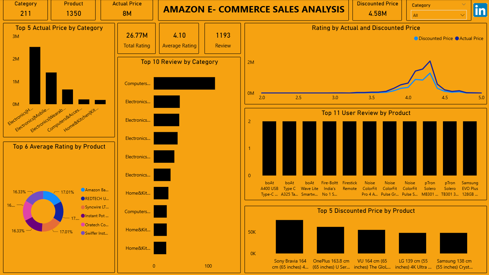

# Amazon-E-Commerce Sales Analysis (Power BI)

## Project Overview
This project analyzes sales performance in different products to identify trends, high performing products. The dashboard helps business stakeholders make data driven decisions to increase revenue.

## Business Problem
How can we understand sales performance across different categories and regions to help optimize marketing and inventory strategies?

## Tools Used 
- Power BI, DAX, Data Visualization, Data Modeling

## Analysis Process 
- Imported and cleaned raw sales data 
- Created interactive dashboards with key sales metrics
- Analyzed sales trends by product category, region and time
- Built visualizations to identify top-performing products and areas needing attention

## Key Insights
- Electronics and Home & Kitchen categories generated the highest revenue
- Sales peak during holiday seasons, especially in North American region
- Certain regions showed lower sales, indicating potentialmarkwt opportunities
- Identified seasonality trends that can guide inventory planning

## Business Recommendations
- Increase marketing spend on Electronics and Home & Kitchen during peak seasons
- Explore expansion or targeted campaigns in underperforming regions
- Use Sales trend data for improved stock forecasting and supply chain management

## Visual

